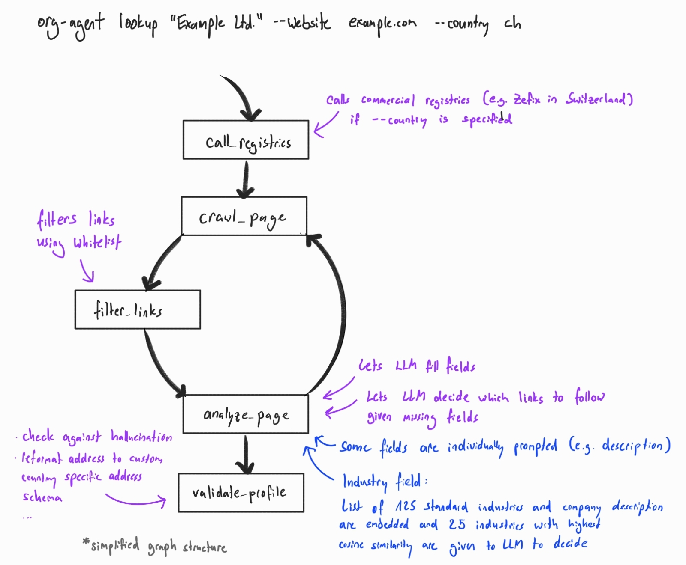

> [!WARNING]
> **Work in Progress:** This repository is currently under development.


# org-agent 🤖

`org-agent` enriches an organization profile from a company or organization name and a known website.

It is a Python package and CLI built with LangGraph, Playwright, Typer, Rich, and `uv`.

## What It Does

- Looks up an organization by name.
- Uses the provided website as the crawl starting point.
- Crawls the website with Playwright. 
- Follows useful links found on the website in breadth-first order, such as contact, imprint, legal, privacy, and about pages.
- Optionally queries supported country registry APIs.
- Sends gathered evidence to an LLM.
- Returns separate website and registry profiles with evidence entries.

## LangGraph Graph Structure



## Setup

```bash
uv sync --extra dev
uv run playwright install chromium
```

Create a `.env` file in the project root.


```env
# Required environment variables:
ORG_AGENT_LLM_PROVIDER=openai|anthropic|ollama
ORG_AGENT_LLM_MODEL=<model name>

# Required for OpenAI/Anthropic:
ORG_AGENT_API_KEY=<provider API key>

# Required for Ollama:
ORG_AGENT_OLLAMA_BASE_URL=<Ollama base URL>

# Optional: Swiss company register credentials for --country ch
ORG_AGENT_REGISTRY_CH_USERNAME=<Swiss registry username>
ORG_AGENT_REGISTRY_CH_PASSWORD=<Swiss registry password>

# Optional runtime environment variables:
ORG_AGENT_REQUEST_TIMEOUT=<seconds, default 20>
ORG_AGENT_CRAWL_MAX_PAGES=<pages, default 6>
ORG_AGENT_CRAWL_MAX_DEPTH=<link depth, default 2>
ORG_AGENT_CRAWL_LOG_ENABLED=<true|false, default true>
ORG_AGENT_CRAWL_LOG_DIR=<directory for per-run page text logs, optional>
ORG_AGENT_PLAYWRIGHT_HEADLESS=<true|false, default true>
ORG_AGENT_PLAYWRIGHT_SLOW_MO=<milliseconds, default 0>
ORG_AGENT_DESCRIPTION_SYSTEM_PROMPT=<system prompt for dedicated description extraction>
ORG_AGENT_INDUSTRIES_CSV=src/org_agent/data/industries.csv
ORG_AGENT_MAX_INDUSTRIES=<count, default 1>
ORG_AGENT_INDUSTRY_SHORTLIST_SIZE=<count, default 25>
```


## CLI

Run `uv run org-agent` to show the help dashboard.

Common lookup options:

- `--website <url>`: required official website. Bare domains like `example.com` are accepted and normalized to `https://example.com`.
- `--country <code>`: enable optional country registry integration, for example `ch`
- `--json`: print raw JSON output with separate `website_profile` and `registry_profile` objects
- `--quiet`: suppress progress output

Run with a known website:

```bash
uv run org-agent lookup "Example Ltd" --website https://example.com/
```

Bare domains are accepted:

```bash
uv run org-agent lookup "Example Ltd" --website example.com
```

Print JSON:

```bash
uv run org-agent lookup "Example Ltd" --website https://example.com --json
```

Suppress progress output:

```bash
uv run org-agent lookup "Example Ltd" --website https://example.com --quiet
```

The `lookup` command supports `--quiet` to suppress the live trace and show only the result.

Use a country registry integration:

```bash
uv run org-agent lookup "Example Ltd" --website example.com --country ch
```

`--website` is required even when country registry lookup is enabled. The `--country` option selects the registry API integration only; it does not affect which website is crawled or which website fields are extracted. If the required country registry credentials are missing, the registry lookup is skipped and the website crawl continues normally.

## Website Crawling
 
The crawler starts only from the provided website URL. It does not search for a website and does not guess paths like `/contact` or `/impressum`.

The crawler:

- opens the website with Playwright
- waits briefly for the page to settle
- scrolls the page to trigger lazy-loaded content
- extracts visible body text
- extracts actual links from the page
- removes obvious junk links such as carts, login pages, product detail pages, campaigns, and social media
- keeps links with organization-information signals in the link text or URL, such as contact, imprint/legal, privacy, company/about, story, or terms
- orders filtered links so links with configured keywords in their visible link text are shown first, preserving page order within each group
- sends at most the first 25 filtered and ordered candidate links to the LLM for link selection
- asks the LLM to update the partial profile from the current page
- asks the LLM whether enough information has been collected
- asks the LLM which remaining candidate links should be visited next, prioritizing links likely to contain fields that are still missing
- repeats page-by-page up to the configured crawl limits

The crawl uses a hybrid approach. The `filter_links` node deterministically filters and orders candidate links before the LLM sees them. Candidate links must contain an organization-information signal in the URL or visible link text, such as contact, imprint/legal, privacy, company/about, story, or terms. The later `analyze_page` node receives at most the first 25 filtered and ordered links plus the fields still missing from the profile, then asks the LLM which links should be crawled next. The crawler processes queued links in breadth-first order and does not invent `/contact` or `/impressum` paths.

The `description` and `industry` fields use dedicated prompts instead of the generic page extraction prompt. `description` is generated from the current crawled page text using `ORG_AGENT_DESCRIPTION_SYSTEM_PROMPT`. After description generation, `industry` is selected from `ORG_AGENT_INDUSTRIES_CSV`. The industries CSV is a headerless comma-separated list, for example `Additive Manufacturing,Metal-Organic Frameworks (MOF),Advanced Manufacturing`. If the list contains more entries than `ORG_AGENT_INDUSTRY_SHORTLIST_SIZE`, the generated description and industry labels are embedded with `intfloat/multilingual-e5-small`, the closest configured industries are shortlisted, and the LLM chooses at most `ORG_AGENT_MAX_INDUSTRIES`. Returned industries are accepted only if they exactly match entries from the CSV.

Default crawl limits:

```env
ORG_AGENT_CRAWL_MAX_PAGES=6
ORG_AGENT_CRAWL_MAX_DEPTH=2
```

Set `ORG_AGENT_CRAWL_LOG_DIR=logs` to save captured page text. Each command execution creates a new timestamped subdirectory and writes one `.txt` file per captured web page. Set `ORG_AGENT_CRAWL_LOG_ENABLED=false` to disable this logging.

To watch Playwright operate in a visible browser window, disable headless mode:

```env
ORG_AGENT_PLAYWRIGHT_HEADLESS=false
ORG_AGENT_PLAYWRIGHT_SLOW_MO=300
```

`ORG_AGENT_PLAYWRIGHT_SLOW_MO` adds a delay in milliseconds to Playwright actions, which makes navigation easier to observe.

The default trace shows concise `Checking:` lines while crawling, the exact links passed to the LLM for each page, the links the LLM selected, then a final crawl tree. In the tree:

- green links were selected as LLM input
- gray links were skipped or queued but not visited
- `(no_link_text)` means the link had no visible anchor text
- character counts show how much visible text was extracted from each LLM input page

Example tree shape:

```text
website Crawl tree: 6 page(s) selected as LLM input
website `-- https://www.example.com -> https://www.example.com  LLM input, 2400 chars
website     |-- Contact -> https://www.example.com/contact  LLM input, 900 chars
website     |-- Imprint -> https://www.example.com/imprint  LLM input, 1300 chars
website     `-- Privacy -> https://www.example.com/privacy  queued, not visited
```

## Country Registries

Country registry APIs are optional and selected by country code. Supported country codes currently include `ch` for the Swiss company register.

Swiss registry credentials are optional. If either value is missing, `--country ch` skips the registry lookup and continues with the website crawl.

```env
ORG_AGENT_REGISTRY_CH_USERNAME=<Swiss registry username>
ORG_AGENT_REGISTRY_CH_PASSWORD=<Swiss registry password>
```

Country registry responses are collected separately from the website crawl. They are returned in `registry_profile` and do not influence website crawling or website field extraction.

## Python API

```python
from org_agent import lookup_organization

result = lookup_organization(
    "Example Ltd",
    website="https://example.com",
)

print(result.website_profile.model_dump())
print(result.registry_profile.model_dump() if result.registry_profile else None)
```

Async API:

```python
from org_agent.api import lookup_organization_async

result = await lookup_organization_async(
    "Example Ltd",
    website="https://example.com",
)
```

## Output Fields

The result is a `LookupResult` with separate `website_profile` and `registry_profile` entries. Each profile is an `OrganizationProfile` with:

- `queried_name`
- `official_company_name`
- `website`
- `registration_id`
- `legal_form`
- `industry`
- `description`
- `purpose`
- `address`
- `legal_address`
- `phone`
- `email`
- `country`
- `region`
- `evidence`

The `queried_name` field is the original name passed to the lookup command or API. The CLI displays website and registry fields in separate tables. The `description` is generated by a dedicated description prompt configured with `ORG_AGENT_DESCRIPTION_SYSTEM_PROMPT`. The `industry` field is selected from the configured industries CSV and may contain multiple comma-separated canonical entries when `ORG_AGENT_MAX_INDUSTRIES` is greater than 1. Fields such as `legal_form` and `country` may appear in both `website_profile` and `registry_profile` because they come from independent sources. The `evidence` entries explain sources and decisions for each profile.

The experiment evaluator accepts the same country registry input as normal lookups, for example `--country ch`.

## Development

Run checks:

```bash
uv run ruff check .
uv run pytest
```

Show CLI help:

```bash
uv run org-agent --help
uv run org-agent lookup --help
```
