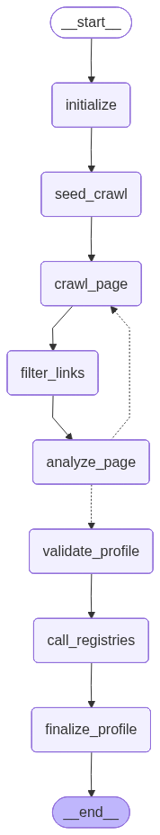

# org-agent

`org-agent` enriches an organization profile from a company or organization name and, optionally, a known website.

It is a Python package and CLI built with LangGraph, Playwright, Typer, Rich, and `uv`.

## What It Does

- Looks up an organization by name.
- Uses a provided website, or discovers one through an optional search provider.
- Crawls the website with Playwright. 
- Follows useful links found on the website, such as contact, imprint, legal, privacy, and about pages.
- Optionally queries configured registry API endpoints.
- Sends gathered evidence to an LLM.
- Returns a structured organization profile with derivation evidence.

## Workflow



## Setup

```bash
uv sync --extra dev
uv run playwright install chromium
```

Create a `.env` file in the project root.

Ollama example:

```env
ORG_AGENT_LLM_PROVIDER=ollama
ORG_AGENT_LLM_MODEL=llama3.1
ORG_AGENT_OLLAMA_BASE_URL=http://localhost:11434
```

API example:

```env
ORG_AGENT_LLM_PROVIDER=openai|anthropic
ORG_AGENT_LLM_MODEL=gpt-4.1-mini|claude-3-5-haiku-latest
ORG_AGENT_API_KEY=your-provider-key
```

Optional variables:

```env
ORG_AGENT_REQUEST_TIMEOUT=20
ORG_AGENT_CRAWL_MAX_PAGES=6
ORG_AGENT_CRAWL_MAX_DEPTH=2
```

## CLI

Run with a known website:

```bash
uv run org-agent lookup "Zweifel Chips & Snacks AG" --website https://zweifel.ch/
```

Print JSON:

```bash
uv run org-agent lookup "Example Ltd" --website https://example.com --json
```

Suppress progress output:

```bash
uv run org-agent lookup "Example Ltd" --website https://example.com --quiet
```

Use a registry config:

```bash
uv run org-agent lookup "Example Ltd" --config org-agent.yaml
```

Name-only lookup requires either a configured search provider or an enabled registry config. If neither is configured, provide `--website`.

## Search

Search is optional. Supported providers are:

- `none`
- `tavily`
- `brave`

Example:

```env
ORG_AGENT_SEARCH_PROVIDER=tavily
ORG_AGENT_SEARCH_API_KEY=your-search-key
```

If `ORG_AGENT_SEARCH_PROVIDER=none`, the agent will not try to discover a website from the name.

## Website Crawling
 
The crawler starts only from the provided or discovered website URL. It does not guess paths like `/contact` or `/impressum`.

The crawler:

- opens the website with Playwright
- waits briefly for the page to settle
- scrolls the page to trigger lazy-loaded content
- extracts visible body text
- extracts actual links from the page
- scores links with deterministic code
- follows useful links up to the configured crawl limits

The LLM does not decide which links to follow. Link scoring and filtering are deterministic crawler logic.

Default crawl limits:

```env
ORG_AGENT_CRAWL_MAX_PAGES=6
ORG_AGENT_CRAWL_MAX_DEPTH=2
```

The default trace shows concise `Checking:` lines while crawling, then a final crawl tree. In the tree:

- green links were selected as LLM input
- gray links were skipped or queued but not visited
- `(no_link_text)` means the link had no visible anchor text
- character counts show how much visible text was extracted from each LLM input page

Example tree shape:

```text
website Crawl tree: 6 page(s) selected as LLM input
website `-- https://www.example.com -> https://www.example.com  LLM input, 2400 chars
website     |-- Contact -> https://www.example.com/contact  LLM input, 900 chars
website     |-- Imprint -> https://www.example.com/imprint  LLM input, 1300 chars
website     `-- Privacy -> https://www.example.com/privacy  queued, not visited
```

## Registry Config

Registry APIs are optional. The config is intentionally generic because registry APIs differ by country and provider.

Example `org-agent.yaml`:

```yaml
registries:
  - name: example_registry
    base_url: https://api.example.com/search
    method: GET
    query_param: q
    api_key_env: EXAMPLE_REGISTRY_API_KEY
    api_key_header: Authorization
    api_key_prefix: "Bearer "
    enabled: true
```

Registry responses are collected and passed to the extraction step as evidence.

## Python API

```python
from org_agent import lookup_organization

profile = lookup_organization(
    "Example Ltd",
    website="https://example.com",
)

print(profile.model_dump())
```

Async API:

```python
from org_agent.api import lookup_organization_async

profile = await lookup_organization_async(
    "Example Ltd",
    website="https://example.com",
)
```

## Output Fields

The result is an `OrganizationProfile` with:

- `name`
- `website`
- `registration_id`
- `legal_form`
- `industry`
- `description`
- `address`
- `phone`
- `email`
- `country`
- `region`
- `derivation`
- `confidence`

The `description` should be factual and non-promotional. The `derivation` entries explain sources, decisions, and field-level confidence.

## Development

Run checks:

```bash
uv run ruff check .
uv run pytest
```

Show CLI help:

```bash
uv run org-agent --help
uv run org-agent lookup --help
```
